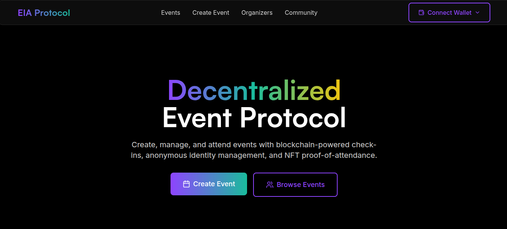
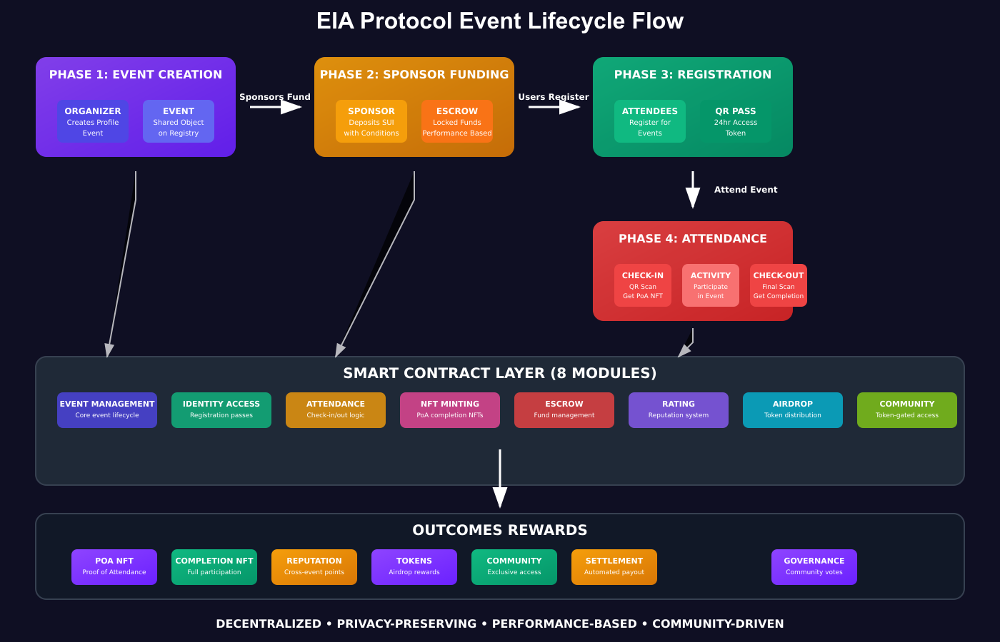

<div align="center">
  <picture>
    
  </picture>
</div>

<h3 align="center">
  Ephemeral Identity & Attendance Protocol - EIA
</h3>

<br/>

<p align="center">
  <a href="LICENSE">
    
  </a>
  
</p>

<div align="center">
  <span>
    EIA Protocol transforms event management through Web3 primitives, offering decentralized identity, verifiable attendance, and community-driven governance. Built on Sui blockchain for scalability and performance.
  </span>
</div>

---

<p align="center">
  
</p>

## 🚀 How It Works

EIA Protocol enables seamless event management through blockchain-native features:

- **Organizers** create events with reputation tracking and performance metrics
- **Attendees** get ephemeral access passes and earn NFT proofs of attendance
- **Sponsors** fund events with automated performance-based settlements
- **Communities** form around events with token-gated access

<p align="center">

</p>

## ⚡ Key Features

### 🎫 **Event Management**

- Create and manage events with real-time capacity tracking
- Public organizer profiles with on-chain reputation
- Sponsor conditions with automated fund release

### 🔐 **Privacy-First Attendance**

- Ephemeral access passes (24hr validity)
- QR code-based check-in/check-out
- No persistent identity storage

### 🏆 **NFT Proof System**

- Proof-of-Attendance (PoA) NFTs on check-in
- Completion NFTs for full event participation
- Dynamic NFT metadata with event details

### 💰 **Automated Settlements**

- Escrow-based sponsor funding
- Performance-based fund release
- Transparent rating and reputation system

### 🌐 **Token-Gated Communities**

- Event-based community formation
- NFT-gated access control
- Governance and resource sharing

## 🏗️ Architecture

### Smart Contracts (Move on Sui)

```
move/sources/
├── event_management.move      # Core event lifecycle
├── identity_access.move       # Registration & passes
├── attendance_verification.move # Check-in/out logic
├── nft_minting.move          # PoA & completion NFTs
├── escrow_settlement.move    # Sponsor fund management
├── rating_reputation.move    # Event & organizer ratings
├── airdrop_distribution.move # Token reward system
└── community_access.move     # Token-gated communities
```

### Frontend (React + TypeScript)

```
src/
├── components/    # Reusable UI components
├── pages/        # Route pages & views
├── lib/          # Sui SDK integration
├── hooks/        # Custom React hooks
└── types/        # TypeScript interfaces
```

## 📖 Usage

### For Event Organizers

1. **Create Profile**: Build on-chain reputation
2. **Create Event**: Set capacity, timing, and sponsor conditions
3. **Activate Event**: Open registration to attendees
4. **Verify Attendance**: Scan QR codes at event
5. **Complete Event**: Trigger NFT minting and settlements

### For Attendees

1. **Discover Events**: Browse through global event registry
2. **Register**: Get ephemeral 24hr access pass
3. **Check-in**: Scan QR code to receive PoA NFT
4. **Participate**: Attend event activities
5. **Check-out**: Complete attendance for completion NFT

### For Sponsors

1. **Fund Events**: Escrow SUI tokens with performance conditions
2. **Track Performance**: Monitor attendance and ratings
3. **Automatic Settlement**: Funds released based on event success

## 🧪 Development Status

> [!WARNING]
> EIA Protocol is in **ALPHA** and should be considered experimental.
> Use testnet for development and testing.

## 📚 Documentation

- [Smart Contract API](./move/docs/)

## 📄 License

Licensed under the MIT License. See [LICENSE](LICENSE) for more information.

## 🌟 Built With

- **Blockchain**: [Sui](https://sui.io/) - High-performance Layer 1
- **Smart Contracts**: [Move](https://move-language.github.io/) - Safe, fast, and expressive
- **Frontend**: [React](https://reactjs.org/) + [TypeScript](https://typescriptlang.org/)
- **Styling**: [Tailwind CSS](https://tailwindcss.com/)
- **Build Tool**: [Vite](https://vitejs.dev/)

---

## Star History

Thanks for the crazy support 💖

[](https://star-history.com/#northernreachtech-cpu/eia&Date)
